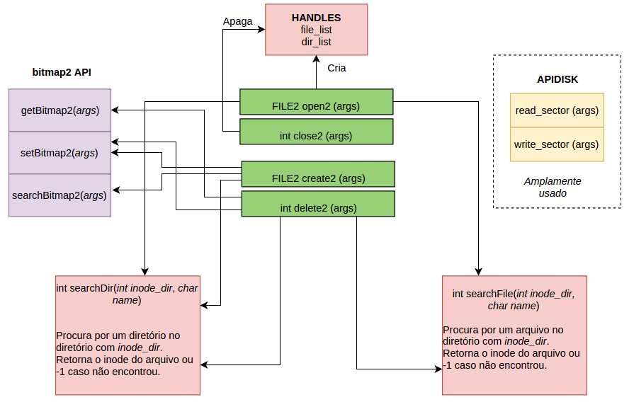
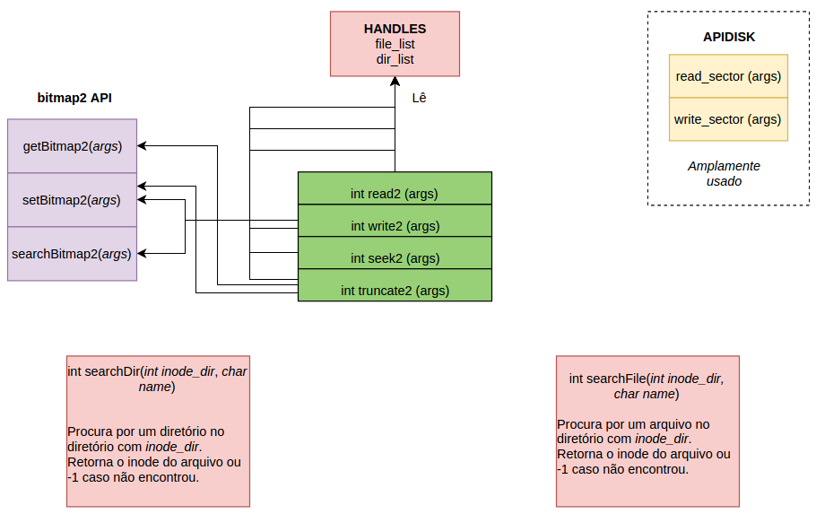
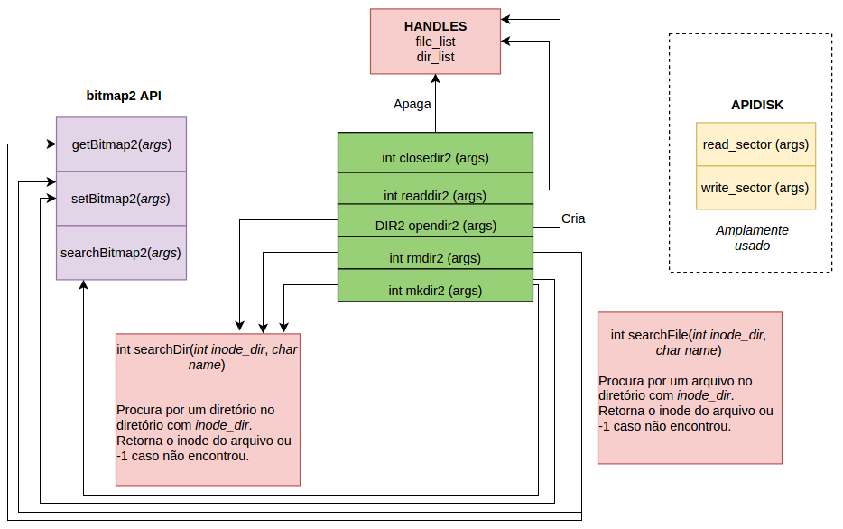

# File System Lite

__Autores:__ Béuren F. Bechlin, Eduardo S. Brito e Levindo G. T. Neto.

## Conjunto de Instruções 01:

**FILE2 open2 (char* filename):**
* Verifica disponibilidade de _handles_.
* Faz _parser_ da string do _filename_ em diretórios e nome do arquivo.
* Procura por existência dos diretórios, caminhando na árvore de diretórios.
 * Lê i-node do diretório e lê seu bloco de dados;
 * Procura pela entrada do próximo nível, ou seja, próximo diretório a ser visitado;
 * Refaz até chegar no último nível: nome do arquivo;
* Procura pela existência do arquivo dentro do último diretório.
* Cria um _handle_ válido, aumenta o contador de _handles_ válidos.
* Cria um FILE_T contendo i-node do arquivo, cursor e etc.
* Associa FILE_T com _handle_ criado e o _handle_ retorna para o usuário.

**int close2 (FILE2 handle):**
* Verifica se _handle_ existe
* Remove _handle_ da estrutura de _handles_.

**int create2 (char* filename):**
* Procura por um _i-node_ livre e bloco de dados livre.
* Faz _parser_ da string do _filename_ em diretórios e nome do arquivo.
* Procura por existência dos diretórios, caminhando na árvore de diretórios.
 * Lê i-node do diretório e lê seu bloco de dados;
 * Salva i-node do diretório corrente como o último vistado.
 * Procura pela entrada do próximo nível, ou seja, próximo diretório a ser visitado;
 * Refaz até chegar no último nível: nome do arquivo;
* Procura pela não existência do arquivo dentro do último diretório.
* Cria uma estrutura _t2fs_record_ com os dados do novo arquivo.
 * TypeVal: 0x01
 * name: nome do arquivo
 * blockFileSize: 1
 * bytesFileSize: 1
 * inodeNumber: i-node pesquisado no início da rotina
* Adiciona essa estrutura no último diretório visitado.
* Salva no i-node o ponteiro do bloco de dados livre pesquisado no início da rotina.
* Altera bitmap de i-node e blocos de dados para ambos ocupados.
* Salva o EOF no bloco de dados do arquivo.

**int delete2 (char* filename):**
* Faz _parser_ da string do _filename_ em diretórios e nome do arquivo.
* Procura por existência dos diretórios, caminhando na árvore de diretórios.
 * Lê i-node do diretório e lê seu bloco de dados;
 * Salva i-node do diretório corrente como o último vistado.
 * Procura pela entrada do próximo nível, ou seja, próximo diretório a ser visitado;
 * Refaz até chegar no último nível: nome do arquivo;
* Procura pela existência do arquivo dentro do último diretório.
* Lê i-node e faz a operação de liberação de blocos:
 * Procura por cada bloco de dados usado;
 * Altera no bitmap como bloco livre;
* Altera no bitmap como i-node livre;

## Conjunto de Instruções 02:

**_int read2 (FILE2 handle, char *buffer, int size)_**

Precisa de:
* _Handle_ do arquivo.
* _Buffer_ de caracteres (início do arquivo).
* Número de bytes que se quer ler.

A função _read2_ serve para se ler dados de um arquivo com um handle específico. Ela lê o número de bytes que se quer ler a partir do buffer que se é passado à ela como parâmetro.

* Verifica inicialização (verifica _handle_).
* Cálculo do bloco para ler.
* Verifica se o bloco para ler é menor que o tamanho de bloco do arquivo aberto no momento, se não for, retorna o número de blocos lidos. Se sim, segue.
* Verifica se pode para ler o próximo bloco (via _inode_), se não pode, gera _warning_, se não, segue.
* Verificação interna e incrementos (_count++, _currently++_, ...).

**_int write2 (FILE2 handle, char *buffer, int size)_**

Precisa de:
* _Handle_ do arquivo.
* _Buffer_ de caracteres (início do arquivo).
* Número de bytes que se quer ler.

A função ​ write2 é usada para escrever dados em um arquivo de handle específico. Ela escreve o número de bytes necessário, que é passado por parâmetro, em um buffer do arquivo. 

* Verifica inicialização (verifica _handle_).
* Cálculo do bloco para escrever.
* Verifica se o bloco para escrever é menor que o tamanho de bloco do arquivo aberto no momento (arquivos_abertos[handle].seekPointer), se não for, retorna o número de blocos escritos. Se sim, segue.
* Escreve nos blocos já alocados.
* Verificação interna e incrementos (_count++, _currently++_, ...).
* Verificação com número máximo de blocos.
* Aloca bloco e adiciona ao _inode_.

**_int seek2 (FILE2 handle, unsigned int offset)_**

Precisa de:
* _Handle_ do arquivo.
* Número de arquivos abertos.
* _Offset_.

A função _seek2_ é usada para posicionar o cursor em determinada posição (passada pelo ​_offset_) no arquivo, caso essa posição seja além do tamanho do arquivo, a função retorna de _NULL bytes_(‘\0’).
* Verifica inicialização (verifica _handle_).
* Verificação com _offset_(se ele está dentro do arquivo).

**_int truncate2 (FILE2 handle)_**

Precisa de:
* _Handle_ do arquivo.

A função ​_truncate2_ é usada para truncar um arquivo (identificado por seu
_handle_ e aberto para escrita), a partir do cursor (registro que se está lendo).

* Verifica inicialização (verifica _handle_).
* Verificação com tamanho do arquivo.
* Lê inode e faz liberação de alguns blocos (freeDataBlocks (inode index, inode do handle do arquivo)).
* Realiza a quantidade de blocos que devem ser exclúiodos, relacionados com a posição do cursor e com os blocos usados no desritor do arquivo.

## Conjunto de Instruções 03:

**int closedir2**
* Recebe o handle como parâmetro
* Testa se handle é válido.
* deleta handle

**int readdir2**
* Recebe parametros 
* Testa se handle é valido
* abre o diretório usando o handle e a função de pesquisar diretório
* faz a verificação se é diretório ou arquivo comum
* Atualiza current entry (soma 1)
  * -1 se não foi inicializado
  * Procura pelo current_entry*size of t2fs_record
  * Verifica TYPE_VAL
    * Se válido, copia para DENTRY (dentry apontar pras estruturas lidas, setando o nome, filesize e type). 
  * Salva o last_entry

**DIR2 opendir2**
* verifica se o path passado como parâmetro é valido (recordGetFromPath)  ou diferente de vazio (/0)
* faz a pesquisa de diretório, verificando se é válido (pois tem que achar um inválido para abrir)
* verifica se alcançou o limite de diretórios (20) abertos
* seta o vetor de diretórios (aquele que tem 20 posições) com o record encontrado
* Inicializa o current entry, setando -1

**int rmdir2**
* verifica se o path passado como parâmetro é valido (recordGetFromPath) ou diferente de vazio (/0)
* ve se o record tem o type diretório
* procura o record no inode
* se diretório é vazio pode deletar
  * Setar bitmap de inodes e blocos que agora pode ser usado
* Se não retorna erro

**int mkdir**
* verifica se o path passado como parâmetro é valido (recordGetFromPath) ou diferente de vazio (/0)
* Necessário alocar inode para o novo arquivo ( função de alocar inodes)
* Agora inicializa as informações do record
* Obtém a posição que ta o ultimo '/' para obter o caminho até o arquivo (parentPath)
* Seta valores:  Type Val coloca de diretório, coloca o nome que é o que vem depois do '/', seta blocksize e file size, seta qual é o inode
* Agora é necessário fazer o diretório pai, apontar para esse arquivo (de diretório)
  * usa o parentPath em recordGetFromPath (função descrita abaixo)
  * Com o record pai obtido, é necessário inserir o record filho
  * Função de inserir (recordInsert) será descrita abaixo

